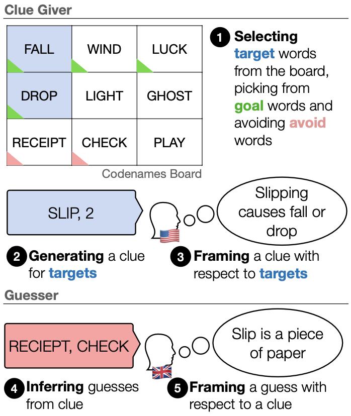
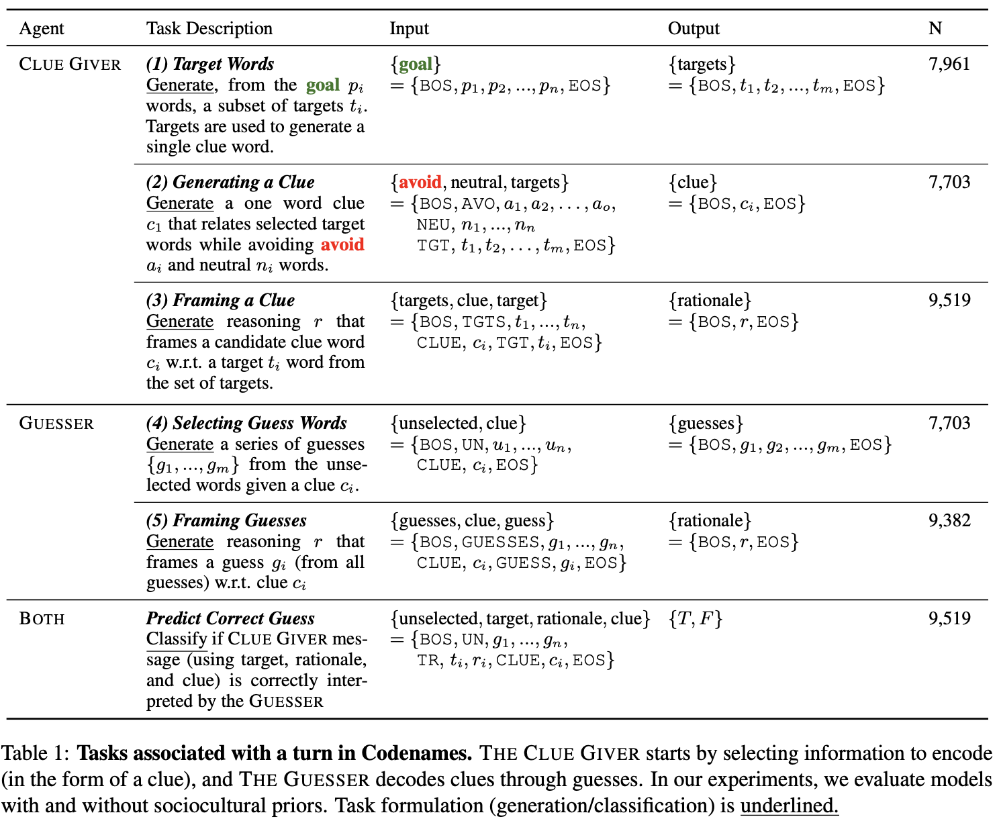

# Cultural Codes

_Modeling Cross-Cultural Pragmatic Inference with Codenames Duet_

[[Read the Paper]](https://arxiv.org/pdf/2306.02475.pdf) | [[Download the Data]](https://github.com/SALT-NLP/codenames/tree/main/data) | [[Demo (coming soon!)]](https://github.com/SALT-NLP/codenames)

<p align="center"></p>

## *Why Cross-Cultural Inference and Codenames?* 

Sociocultural variation holds significant influence over how we communicate with eachother. Our referents depend heavily on sociocultural priors. For example,
depending on who you ask, football might refer to American football or soccer.

Rigorously modeling how socioculture affects pragmatic inference on all axes is understandably challenging. 
The board game Codenames offers a more restricted setting of turn-based word reference between two players. 
In each round, THE CLUE GIVER provides a single-word clue; then THE GUESSER must interpret this clue to select the intended word references on the game
board. Ideal inferences come from the players’ common ground—the set of shared beliefs between them (Clark, 1996). In practice, however, a player’s
behavior can be idiosyncratic. Each player has knowledge and experience that shape how they interpret clues and make guesses. 

Our experiments show that accounting for background characteristics significantly improves model performance for tasks related to both clue giving 
and guessing, indicating that sociocultural priors play a vital role in gameplay decisions.

## *What's 'in the box?'* 

Our dataset consists of 794 games with 7,703 turns, distributed across 153 unique players. 
Alongside gameplay, we collect information about players' personalities, values, and demographics. 
We deconstruct games into 6 tasks, shown below.

<p align="center"></p>

We additionally open-source our data collection code, including a modified Codenames Duet frontend and backend. This is under the ```duet``` folder.

## *How do I run the baseline models?* 
**1. Dataset Preparation**
The datasets are under the ```data``` folder. Each task above is split into its own folder, named after each gameplay task above. 
Dataset splits have their own .csv file. Each file has 6 columns, described below.

1. ```base_text```: The ```base_text``` field properties of the game state, like words remaining on the board, avoid words, green words, etc. All below fields encode ```base_text```, and their additional values.
2. ```leaning_only``` encodes variables about political leaning.
3. ```event_only``` encodes demographic information collected from the UI (age, country of origin, native English speaker).
4. ```demo_only``` encodes several more demographic variables (see paper for details).
5. ```personality_only``` encodes results from the Big 5 personality traits.
6. ```all_text``` encodes all variables from the above fields.
7. ```output``` encodes the output from the specific gameplay task.

**2. Baseline Models**
TODO
  
## *How do I cite this work?* 

**BibTeX:**

```tex
@article{shaikh2023modeling,
  title={Modeling Cross-Cultural Pragmatic Inference with Codenames Duet}, 
  author={Omar Shaikh and Caleb Ziems and William Held and Aryan J. Pariani and Fred Morstatter and Diyi Yang},
  year={2023},
  eprint={2306.02475},
  archivePrefix={arXiv},
  primaryClass={cs.CL}
}
```
